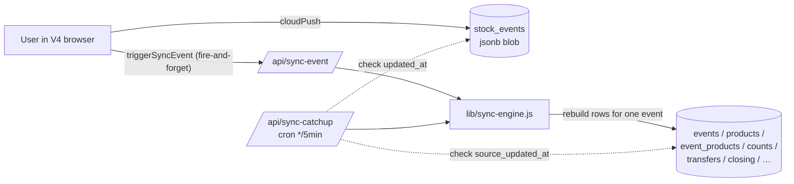

# V4 → V4-merged Migration Runbook

A continuous-projection, zero-downtime migration from V4's `stock_events`
jsonb blob model into the v2 relational schema (with V4 extensions). The
blob remains the source of truth until cutover; v2 tables are
continuously rebuilt from it by a sync function so the merged app can
launch on a fully populated relational database with no freeze and no
data loss.

## What's in this repo (Phase 2/3 deliverables)

| Path | What it does |
|------|--------------|
| [`migrations/001_base_v2_schema.sql`](../migrations/001_base_v2_schema.sql) | All v2 base tables (events, products, event_products, distribution, bars, recipients, stock_counts, transfers, deliveries, …). |
| [`migrations/002_v4_extensions.sql`](../migrations/002_v4_extensions.sql) | V4-only additions: `event_products.already_in_stock`, `closing_stock.closing_cases/closing_singles/carried_over`, `events.event_type/linked_event_id`, plus new tables for topups, wastage, till/modifier imports, recipes, bug_reports. |
| [`migrations/003_sync_infrastructure.sql`](../migrations/003_sync_infrastructure.sql) | `legacy_id_map`, `system_sync_state`, plus `events.legacy_id`/`synced_at`/`source_updated_at`/`last_sync_error*` columns. |
| [`migrations/004_rls_policies.sql`](../migrations/004_rls_policies.sql) | Open RLS policies on the new tables that mirror the current `stock_events` access pattern. |
| [`migrations/_rollback_all.sql`](../migrations/_rollback_all.sql) | Drops everything from 001-003 in dependency order. `stock_events` is untouched. |
| [`lib/supabase-admin.js`](../lib/supabase-admin.js) | Server-only PostgREST client using the service-role key. |
| [`lib/sync-engine.js`](../lib/sync-engine.js) | Idempotent per-event rebuild logic (`syncEvent`, `syncRecipes`). |
| [`api/sync-event.js`](../api/sync-event.js) | Vercel function called by the frontend after every blob save. |
| [`api/sync-catchup.js`](../api/sync-catchup.js) | Vercel cron / manual catch-up — re-syncs anything stale. |
| [`vercel.json`](../vercel.json) | `*/5 * * * *` cron for `/api/sync-catchup`. |
| [`scripts/backfill.js`](../scripts/backfill.js) | One-shot CLI to seed v2 tables from existing blobs. |

The V4 frontend ([`assets/js/app.js`](../assets/js/app.js)) is unchanged
except for a single `triggerSyncEvent(id)` helper called after each
successful blob write (events, recipes, bugs). If the sync function
isn't deployed yet, the helper is a no-op.

## Data flow



`stock_events` keeps being the source of truth. The v2 tables are a
deterministic projection that's rebuilt-from-scratch (for one event at
a time) on every blob change.

## Migration phases

### Phase 1 — Backup (you've done this once; do it again here)

Before applying any DDL:

1. **Supabase Dashboard → Database → Backups** — confirm PITR is on for
   prod. Take a manual snapshot.
2. **Database → Backups → Export** — download a full JSON of
   `public.stock_events` to `backup/<date>.json` (the existing
   [`backup/backup.json`](../backup/backup.json) is your reference
   baseline of 18 rows / 471 KB).
3. Note the current row count: `SELECT count(*) FROM public.stock_events;`
   — should match the count in your export.

### Phase 2 — Apply schema (DDL) — DEV FIRST

In **Supabase Dashboard → SQL Editor** for the **dev** project
(`tcanalefwoidxuawazcf`):

1. Paste & run [`migrations/001_base_v2_schema.sql`](../migrations/001_base_v2_schema.sql)
2. Paste & run [`migrations/002_v4_extensions.sql`](../migrations/002_v4_extensions.sql)
3. Paste & run [`migrations/003_sync_infrastructure.sql`](../migrations/003_sync_infrastructure.sql)
4. Paste & run [`migrations/004_rls_policies.sql`](../migrations/004_rls_policies.sql)

After each, expect "Success. No rows returned." If any step errors,
fix it on dev and re-run (everything is `CREATE … IF NOT EXISTS` /
`ADD COLUMN IF NOT EXISTS`).

Verify with:

```sql
SELECT table_name
FROM information_schema.tables
WHERE table_schema = 'public'
ORDER BY table_name;
```

You should see all the new tables plus the existing `stock_events`.

### Phase 3 — Run the backfill on DEV

The backfill seeds the v2 tables from the current production blobs so
you can sanity-check the projection against your existing data.

The cleanest way is to **copy your production `stock_events` data into
dev first**, then run the backfill against dev:

```bash
# 1. Copy production blobs into dev (use Dashboard → SQL Editor on prod):
#    SELECT json_agg(row_to_json(t)) FROM public.stock_events t
#     WHERE id IN ('mo95nl29jb46o','mpbb01nnvy0t7','__recipes__');
#    Copy the JSON, then on dev:
#    INSERT INTO public.stock_events (id, name, data)
#    SELECT id, name, data FROM jsonb_to_recordset(
#      $$ <paste here> $$ ::jsonb
#    ) AS x(id text, name text, data jsonb)
#    ON CONFLICT (id) DO UPDATE SET data = EXCLUDED.data;

# 2. Get the dev project's service role key from
#    Supabase Dashboard → Project Settings → API → service_role key.
#    Put it in a local .env.local (gitignored):
cat > .env.local <<EOF
SUPABASE_URL=https://tcanalefwoidxuawazcf.supabase.co
SUPABASE_SERVICE_KEY=<service-role-jwt-for-dev>
EOF

# 3. Run the backfill
node scripts/backfill.js
```

You should see something like:

```
[backfill] SUPABASE_URL = https://tcanalefwoidxuawazcf.supabase.co
[backfill] scope = mo95nl29jb46o, mpbb01nnvy0t7, __recipes__
[backfill] mo95nl29jb46o: OK (1843ms) {"ok":true,...}
[backfill] mpbb01nnvy0t7: OK (4127ms) {"ok":true,...}
[backfill] __recipes__: OK (1216ms) {"ok":true,"recipeCount":91}
[backfill] done in 7186ms — ok=3 err=0
```

If any event errors, the script prints the message + stack. Common
causes: a category/supplier with weird whitespace, a count key with no
underscore, a recipe with no `tillItem`. Fix in `lib/sync-engine.js`
and re-run — it's idempotent.

#### Sanity-check on dev

```sql
-- One row per scoped event, with row counts per child table
WITH e AS (
  SELECT id, name, legacy_id, synced_at, source_updated_at
  FROM public.events WHERE legacy_id IS NOT NULL
)
SELECT e.legacy_id, e.name,
  (SELECT count(*) FROM bars              WHERE event_id = e.id) AS bars,
  (SELECT count(*) FROM recipients        WHERE event_id = e.id) AS recipients,
  (SELECT count(*) FROM event_products    WHERE event_id = e.id) AS products,
  (SELECT count(*) FROM bar_products      WHERE event_id = e.id) AS bar_products,
  (SELECT count(*) FROM distribution      WHERE event_id = e.id) AS distribution,
  (SELECT count(*) FROM closing_stock     WHERE event_id = e.id) AS closing,
  (SELECT count(*) FROM stock_counts      WHERE event_id = e.id) AS counts,
  (SELECT count(*) FROM transfers
     WHERE from_event_id = e.id OR to_event_id = e.id)           AS transfers,
  (SELECT count(*) FROM topup_sessions    WHERE event_id = e.id) AS topups,
  (SELECT count(*) FROM wastage_batches   WHERE event_id = e.id) AS wastage,
  (SELECT count(*) FROM till_imports      WHERE event_id = e.id) AS till,
  e.synced_at, e.source_updated_at
FROM e
ORDER BY e.name;

-- Recipe count
SELECT count(*) AS recipes,
       (SELECT count(*) FROM recipe_ingredients) AS ingredients
FROM public.recipes;
```

Expected based on [`backup/backup.json`](../backup/backup.json):

| event | products | bars | counts | transfers | closing | topups | wastage | till |
|-------|----------|------|--------|-----------|---------|--------|---------|------|
| Highlights 25 | 16 | 6 | (varies) | 1 | (varies) | 0 | 0 | 0 |
| Highlights 26 | 77 | 4 | 1 | 23 batches | 77 | 2 | 4 batches | 0 |

(`__recipes__` should populate 91 recipes.)

### Phase 4 — Apply schema to PROD

Once dev backfill checks out, repeat Phase 2 against the **prod**
project (`qqdvzcaukstfdixnfuqq`). Apply `001` → `002` → `003` → `004`
in the prod SQL Editor.

The new tables will be empty in prod; the next phase fills them.

### Phase 5 — Set env vars on Vercel

In **Vercel Dashboard → Project → Settings → Environment Variables**,
add (for **Production** + **Preview** + **Development** as desired):

| Name | Value |
|------|-------|
| `SUPABASE_URL` | `https://qqdvzcaukstfdixnfuqq.supabase.co` |
| `SUPABASE_SERVICE_KEY` | The service-role JWT from the prod project's Supabase Dashboard → Settings → API. |
| `SYNC_SCOPE` *(optional)* | Comma-separated legacy ids to sync. Defaults to `mo95nl29jb46o,mpbb01nnvy0t7,__recipes__,__bugs__`. Leave unset for the default. |
| `CRON_SECRET` *(strongly recommended)* | Any long random string (e.g. `openssl rand -hex 32`). Vercel will pass `Authorization: Bearer <value>` on cron requests; if set, `/api/sync-catchup` rejects requests without it. |

**Do not** check `SUPABASE_SERVICE_KEY` into git. It's automatically
gitignored via the existing `.env*` rules.

### Phase 6 — Deploy the sync code to PROD

```bash
git add migrations api lib scripts vercel.json middleware.js \
        assets/js/app.js docs/MIGRATION.md
git commit -m "Add v2 sync infrastructure (continuous projection)"
git push                                  # triggers Vercel deploy
```

After the deploy:

- `/api/sync-event` lives at your production domain (PIN-gated).
- `/api/sync-catchup` lives at your production domain (excluded from
  PIN gate, protected by `CRON_SECRET` if set).
- The `*/5 * * * *` cron is registered with Vercel (Hobby plan = once a
  day; Pro plan = every 5 minutes).

Note: on Vercel Hobby/Free, cron runs at most once per day. The
fire-and-forget trigger on every save means v2 stays fresh in real
time anyway — cron is just a safety net. If you want sub-day catch-up
on Hobby, schedule [cron-job.org](https://cron-job.org) or a GitHub
Actions workflow to hit `/api/sync-catchup` every 5 minutes (pass the
`Authorization: Bearer <CRON_SECRET>` header).

### Phase 7 — Backfill PROD

Same as dev, but with prod URL and prod service key in `.env.local`:

```bash
cat > .env.local <<EOF
SUPABASE_URL=https://qqdvzcaukstfdixnfuqq.supabase.co
SUPABASE_SERVICE_KEY=<service-role-jwt-for-prod>
EOF

node scripts/backfill.js
```

(You can also trigger the prod sync remotely via the deployed function
by `POST`ing to `/api/sync-event` with the right cookie — but the
script is faster and surfaces errors directly.)

### Phase 8 — Verify steady state

```sql
-- Lag monitor (run anytime; healthy = "0 stale", or lag in seconds)
SELECT
  COALESCE(e.legacy_id, '__sys__:'||s.key) AS scope,
  COALESCE(se.updated_at, sysse.updated_at)               AS blob_updated_at,
  COALESCE(e.source_updated_at, s.source_updated_at)      AS v2_source_updated_at,
  COALESCE(e.synced_at, s.synced_at)                      AS v2_synced_at,
  COALESCE(se.updated_at, sysse.updated_at)
    - COALESCE(e.source_updated_at, s.source_updated_at)  AS lag
FROM (
  SELECT id AS legacy_id, updated_at FROM stock_events
   WHERE id IN ('mo95nl29jb46o','mpbb01nnvy0t7','__recipes__')
) se
FULL JOIN events e               ON e.legacy_id = se.legacy_id
LEFT JOIN system_sync_state s    ON s.key = se.legacy_id
LEFT JOIN stock_events sysse     ON sysse.id  = s.key
ORDER BY lag DESC NULLS FIRST;
```

A healthy system shows lag close to zero. Anything > a few minutes
should self-correct on the next cron run.

If you see anything in `events.last_sync_error`:

```sql
SELECT legacy_id, name, last_sync_error, last_sync_error_at
FROM events
WHERE last_sync_error IS NOT NULL;
```

Fix the cause in `lib/sync-engine.js`, redeploy, hit `/api/sync-catchup`
to retry.

## Rollback paths

| What broke | Roll back |
|------------|-----------|
| Sync function throwing errors | Vercel Dashboard → Deployments → previous deploy → "Promote to Production". V4 frontend continues to write `stock_events` exactly as today; the v2 tables fall behind until you redeploy or hit `/api/sync-catchup`. |
| Schema migration mistake | `psql` or SQL editor: paste [`migrations/_rollback_all.sql`](../migrations/_rollback_all.sql). Drops every new table. `stock_events` is never touched. |
| Whole project regret | Supabase PITR / the manual JSON export from Phase 1 restore `stock_events` to its exact prior state. The v2 tables, being a projection, are throwaway. |

## What this migration does **not** do

This phase only adds the projection. It deliberately does **not**:

- Change V4's user-facing behaviour
- Stop writing the blob
- Change how V4 reads (still pulls blobs via the anon key)
- Build the merged app (that's Phase 4 below)

Once the v2 tables are continuously current, **Phase 4** is the work of
porting V4's UI to read/write the relational tables panel-by-panel
(library, deliveries, stock levels, warehouses, settings, suppliers
from V2; closing/COGS/recipes/topups/wastage/events/bugs from V4 but
rewired to the relational tables). That happens in a separate PR after
this one is in production and stable.

## Quick reference — manual sync triggers

```bash
# Sync one event from your laptop (uses .env.local creds, no Vercel auth)
node -e "import('./lib/sync-engine.js').then(m => m.syncEvent('mpbb01nnvy0t7')).then(console.log)"

# Sync global recipes
node -e "import('./lib/sync-engine.js').then(m => m.syncRecipes()).then(console.log)"

# Trigger catch-up against production (replace <secret>)
curl -X POST \
     -H "Authorization: Bearer <CRON_SECRET>" \
     https://your-app.vercel.app/api/sync-catchup

# Trigger one event via the deployed function (browser tab, after login)
fetch('/api/sync-event', { method:'POST', headers:{'Content-Type':'application/json'},
                            body: JSON.stringify({event_id:'mpbb01nnvy0t7'}) })
  .then(r => r.json()).then(console.log)
```
